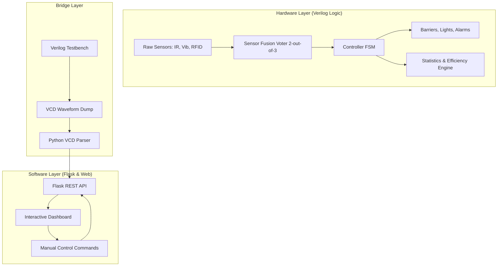

# 🚂 Railway Tycoon: Hardware-Software Co-Design System

## 🌟 Introduction
Railway Tycoon is a professional-grade intelligent Railway Crossing Control System designed using a sophisticated **Hardware-Software Co-Design** approach. It bridges the gap between high-level web visualization and low-level digital logic implementation.

The system features a robust **Verilog HDL logic core** that manages multiple railway crossings with safety-critical features like Sensor Fusion (Triple Modular Redundancy), Speed Estimation, and a real-time Statistics Engine. This hardware logic is integrated into a modern **Python Flask web dashboard**, allowing for real-time monitoring, manual control, and automated simulation scenarios.

## 🏗️ System Architecture
The following diagram illustrates the data flow and integration between the hardware (Verilog) and software (Python/Web) layers:



## 🚀 Getting Started

### 📋 Prerequisites
- **Python 3.11+**
- **Icarus Verilog** (for hardware simulation)
- **GTKWave** (to view logic waveforms)
- **Modern Browser** (Chrome/Edge/Firefox)

### 🛠️ Installation
1. **Clone the project**
   ```bash
   git clone <repository-url>
   cd railway_crossing
   ```

2. **Install Python Dependencies**
   ```bash
   pip install -r requirements.txt
   ```

## 🎮 How to Run

### 1. Start the System Dashboard
Run the main server to host the web interface:
```bash
python api/server.py
```
Open your browser to: **[http://localhost:5000](http://localhost:5000)**

### 2. Run Hardware Simulations (Verilog)
We have provided a one-click batch script for Windows users:
```bash
./run_sim.bat
```
This script will:
1. Compile all Verilog modules using `iverilog`.
2. Run the "Hardware Tycoon" challenge suite.
3. Generate a `game.vcd` waveform file.

### 3. View Logic Waveforms
To inspect the hardware state transitions and sensor signals:
```bash
C:\iverilog\gtkwave\bin\gtkwave.exe game.vcd
```

## 💎 Key Features
- **Triple Modular Redundancy (TMR):** Sensor fusion logic that can withstand individual sensor failures using 2-out-of-3 voting.
- **Hardware-Software Bridge:** Actual Verilog simulation results are parsed and visualized on the web dashboard timeline.
- **Efficiency Scoring:** A hardware-based statistics engine tracks delay cycles and safety violations to rank your performance (Rank S-B).
- **Predictive Maintenance:** The system tracks component health and warns of potential failures before they occur.
- **Interactive UI:** Smooth animations and manual overrides for emergency scenarios.

## 📁 Project Structure
- `/verilog`: Core digital logic implementation (`.v` files).
- `/api`: Python Flask server and VCD parsing logic.
- `/web`: HTML/CSS/JS frontend dashboard.
- `/tests`: Verilog testbenches for automated validation.
- `run_sim.bat`: Automation script for Icarus Verilog.
- `TECHNICAL_REPORT.md`: Detailed academic documentation.
