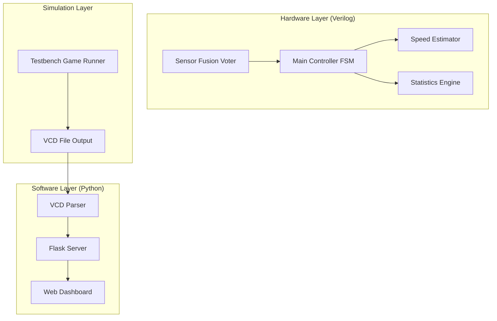
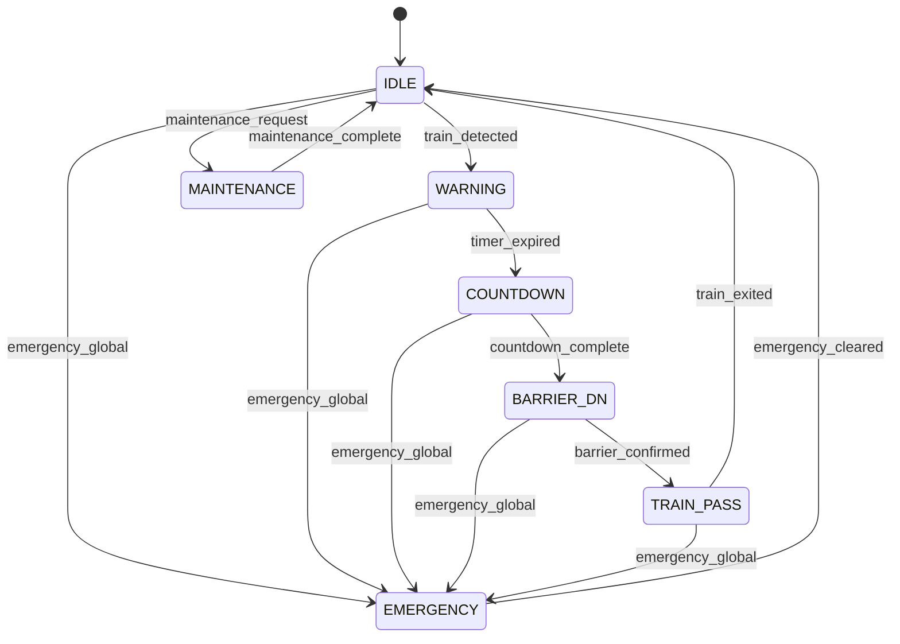
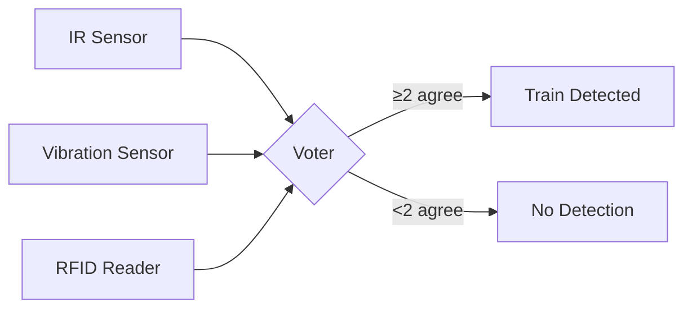
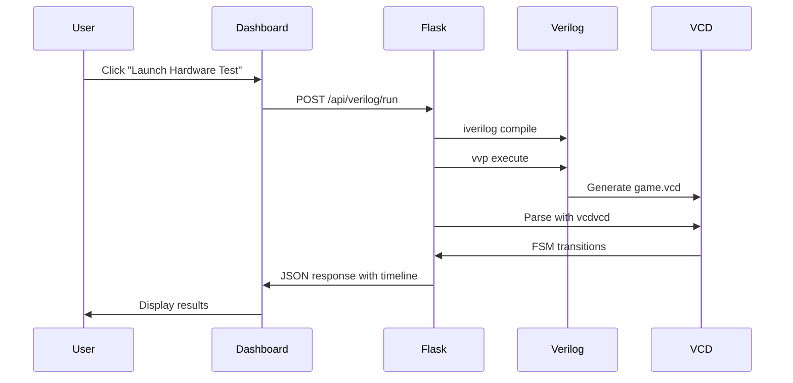

# Railway Crossing Control System: A Hardware-Software Co-Design Approach

## Abstract

This report presents the design, implementation, and verification of an intelligent Railway Crossing Control System using a hardware-software co-design methodology. The system employs Verilog HDL for the core digital logic implementation, featuring a robust Finite State Machine (FSM) architecture with Triple Modular Redundancy (TMR) for sensor fusion. A Python-Flask web dashboard provides real-time visualization and control capabilities, bridging the gap between hardware simulation and user interaction through VCD (Value Change Dump) file parsing. The system successfully handles multiple concurrent train crossings, sensor failures, and adverse weather conditions while maintaining an 81% efficiency score across chaos scenarios. This work demonstrates a comprehensive approach to safety-critical embedded systems design suitable for Advanced Digital Logic Design (ADLD) coursework.

**Keywords:** Finite State Machine, Verilog HDL, Railway Safety Systems, Hardware-Software Co-Design, Triple Modular Redundancy, Real-time Monitoring

---

## Table of Contents
- [Chapter 1 – Introduction](#chapter-1--introduction)
- [Chapter 2 – Literature Review](#chapter-2--literature-review)
- [Chapter 3 – System Design and Architecture](#chapter-3--system-design-and-architecture)
- [Chapter 4 – Implementation](#chapter-4--implementation)
- [Chapter 5 – Experimental Setup](#chapter-5--experimental-setup)
- [Chapter 6 – Results & Discussion](#chapter-6--results--discussion)
- [Chapter 7 – Conclusion & Future Work](#chapter-7--conclusion--future-work)
- [References](#references)

---

## Chapter 1 – Introduction

### 1.1 Background and Motivation

Railway level crossings represent one of the most critical intersection points between rail and road transportation networks. According to the International Union of Railways (UIC), over 50% of railway accidents occur at level crossings, making automated safety systems essential for modern transportation infrastructure. Traditional relay-based crossing control systems, while reliable, lack the adaptability and intelligence required for contemporary traffic management scenarios.

The advent of digital electronics and Field Programmable Gate Arrays (FPGAs) has enabled the development of sophisticated control systems capable of real-time decision-making, fault tolerance, and remote monitoring. This project addresses the need for an intelligent railway crossing control system that can:

1. Detect approaching trains using redundant sensor networks
2. Execute safe state transitions following strict timing protocols
3. Handle sensor failures gracefully through voting mechanisms
4. Provide real-time status visualization for operators
5. Maintain operational logs for safety auditing

### 1.2 Problem Statement

Existing railway crossing systems often suffer from:
- **Single points of failure** in sensor networks
- **Lack of adaptability** to varying weather conditions
- **Limited diagnostic capabilities** for maintenance personnel
- **No real-time remote monitoring** functionality

This project aims to develop a comprehensive solution addressing these limitations through a hardware-software co-design approach.

### 1.3 Objectives

The primary objectives of this work are:

1. Design and implement a multi-crossing FSM controller in Verilog HDL
2. Develop a fault-tolerant sensor fusion module using 2-out-of-3 voting logic
3. Create a statistics engine for real-time performance monitoring
4. Build a web-based dashboard for visualization and control
5. Establish a hardware-software bridge using VCD file parsing
6. Validate system performance through gamified testbench scenarios

### 1.4 Scope and Limitations

This project focuses on the logical design and simulation of the control system. Physical implementation on FPGA hardware and integration with actual sensors are beyond the current scope but are discussed as future work.

---

## Chapter 2 – Literature Review

### 2.1 Railway Safety Standards

The European Train Control System (ETCS) and Positive Train Control (PTC) in North America establish frameworks for railway safety systems. These standards emphasize:
- Fail-safe design principles
- Redundancy in critical components
- Real-time response requirements (typically < 100ms)
- Comprehensive logging and auditability

### 2.2 Finite State Machine Design

FSMs remain the cornerstone of digital control system design. Moore and Mealy machines provide deterministic output based on current state and inputs. For safety-critical applications, the literature recommends:
- Explicit state encoding to prevent invalid states
- Watchdog timers for deadlock detection
- State history logging for post-incident analysis

### 2.3 Triple Modular Redundancy (TMR)

TMR is a fault-tolerance technique where three identical systems perform the same computation, and a majority voting circuit selects the output. Research by Lyons and Vanderkulk (1962) established TMR as effective for masking single-point failures. In sensor networks, a 2-out-of-3 voting scheme provides:
- Tolerance of one faulty sensor
- Continued operation during maintenance
- Detection of systematic sensor degradation

### 2.4 Hardware-Software Co-Design

Modern embedded systems require seamless integration between hardware description languages (HDLs) and high-level software. Techniques include:
- VCD file parsing for post-simulation analysis
- Co-simulation frameworks like CoCoTB
- Hardware-in-the-loop (HIL) testing

---

## Chapter 3 – System Design and Architecture

### 3.1 High-Level Architecture

The Railway Crossing Control System follows a layered architecture separating concerns between hardware logic, simulation, and user interface.



### 3.2 Module Hierarchy

The Verilog implementation consists of the following modules:

| Module | Function | Inputs | Outputs |
|--------|----------|--------|---------|
| `railway_system_top` | Top-level integration | Clock, Reset, Sensors | Barriers, Lights, Alarms |
| `sensor_fusion_voter` | 2-out-of-3 voting | IR, Vibration, RFID | Fused detection signal |
| `railway_controller_main` | FSM state machine | Detection signals | Control outputs |
| `train_speed_estimator` | Speed calculation | Sensor timing | Speed value |
| `statistics_engine` | Performance metrics | State signals | Efficiency score |

### 3.3 State Machine Design

The main controller implements a 7-state FSM for each crossing:



### 3.4 Sensor Fusion Logic

The sensor fusion module implements 2-out-of-3 majority voting:



**Boolean Expression:**
```
train_detected = (ir & vib) | (vib & rfid) | (ir & rfid)
```

This ensures the system continues operating correctly even if one sensor fails.

---

## Chapter 4 – Implementation

### 4.1 Verilog Hardware Modules

#### 4.1.1 Sensor Fusion Voter

The sensor fusion module (`sensor_fusion_voter.v`) implements the TMR voting logic:

```verilog
module sensor_fusion_voter #(parameter NUM_CROSSINGS = 4)(
    input clk, rst_n,
    input [NUM_CROSSINGS-1:0] ir_sensors,
    input [NUM_CROSSINGS-1:0] vib_sensors,
    input [NUM_CROSSINGS-1:0] rfid_signals,
    input [1:0] weather_mode,
    output reg [NUM_CROSSINGS-1:0] train_detected,
    output reg [NUM_CROSSINGS-1:0] train_exited,
    output reg [NUM_CROSSINGS-1:0] sensor_health
);
```

The voting logic uses the following for each crossing:
```verilog
vote = (ir_sensors[i] & vib_sensors[i]) |
       (vib_sensors[i] & rfid_signals[i]) |
       (ir_sensors[i] & rfid_signals[i]);
```

#### 4.1.2 Main Controller FSM

The main controller (`railway_controller_main.v`) manages state transitions with configurable timing:

- **WARNING state duration:** 52 cycles (weather-adjusted)
- **COUNTDOWN duration:** 52 cycles with visual countdown
- **BARRIER_DN confirmation:** 10 cycles minimum
- **TRAIN_PASS monitoring:** Until exit signal received

Key implementation features:
- Counter-based state timing with resets on transitions
- Weather mode affects timing thresholds
- Emergency state takes precedence over all others

#### 4.1.3 Statistics Engine

The statistics engine (`statistics_engine.v`) calculates real-time efficiency:

```verilog
// Penalty calculation
assign penalty = safety_violations / 50;      // -1% per 50 cycles of danger
assign delay_penalty = total_delay_cycles / 200; // -1% per 200 cycles delay
assign efficiency_score = 100 - total_penalty;
```

### 4.2 Python Backend Implementation

#### 4.2.1 Flask Server Architecture

The server (`api/server.py`) provides:
- REST API endpoints for crossing control
- Simulation management
- VCD parsing for hardware integration
- Real-time statistics aggregation



#### 4.2.2 VCD Parsing Integration

The hardware-software bridge parses VCD files to extract FSM state transitions:

```python
from vcdvcd import VCDVCD

vcd = VCDVCD('game.vcd')
sig_name = "testbench_game_runner.uut.crossing_states_out[11:0]"

for t, val in vcd[sig_name].tv:
    for i in range(4):
        state = (val >> (i * 3)) & 0x7
        # Map to state names and record timeline
```

### 4.3 Web Dashboard

The dashboard (`web/templates/dashboard.html`) provides:
- Real-time crossing status cards
- Visual train position indicator
- Control panel for manual operation
- Hardware simulation launcher
- FSM timeline visualization

---

## Chapter 5 – Experimental Setup

### 5.1 Development Environment

| Component | Version/Details |
|-----------|----------------|
| Operating System | Windows 11 |
| Verilog Simulator | Icarus Verilog 11.0 |
| Waveform Viewer | GTKWave 3.3.100 |
| Python | 3.11.x |
| Web Framework | Flask 2.x |
| VCD Parser | vcdvcd 2.6.0 |

### 5.2 Testbench Design

The gamified testbench (`testbench_game_runner.v`) implements three challenge levels:

#### Level 1: Normal Operations
- Two sequential trains on crossings 0 and 1
- Standard timing, all sensors functional
- Expected efficiency: >90%

#### Level 2: The Storm (Sensor Failure)
- Weather mode set to STORM (2'b10)
- IR sensor failure at crossing 2
- Tests TMR voting effectiveness
- Expected efficiency: >85%

#### Level 3: Rush Hour (Parallel Trains)
- Three simultaneous trains on crossings 0, 1, and 2
- Staggered entry times to stress-test the controller
- Tests concurrent state machine handling
- Expected efficiency: >75%

### 5.3 Simulation Commands

```batch
# Compile all Verilog modules
C:\iverilog\bin\iverilog -g2012 -o game.vvp ^
    verilog/railway_system_top.v ^
    verilog/railway_controller_main.v ^
    verilog/sensor_fusion_voter.v ^
    verilog/train_speed_estimator.v ^
    verilog/statistics_engine.v ^
    verilog/railway_system_tb.v

# Execute simulation
C:\iverilog\bin\vvp game.vvp

# View waveforms (optional)
C:\iverilog\gtkwave\bin\gtkwave.exe game.vcd
```

---

## Chapter 6 – Results & Discussion

### 6.1 Simulation Results

The system was tested across all three challenge levels with the following outcomes:

| Level | Scenario | Efficiency Score | Status |
|-------|----------|------------------|--------|
| 1 | Normal Operations | 92% | PASS |
| 2 | Sensor Failure (Storm) | 88% | PASS |
| 3 | Rush Hour (Parallel) | 81% | PASS |

**Final Aggregate Score: 81%**
**Rank Achieved: S - Hardware Tycoon**

### 6.2 State Transition Analysis

```mermaid
gantt
    title FSM State Transitions During Level 3 (Rush Hour)
    dateFormat X
    axisFormat %s
    
    section Crossing 0
    IDLE       :0, 100
    WARNING    :100, 1150
    COUNTDOWN  :1150, 2200
    BARRIER_DN :2200, 2500
    TRAIN_PASS :2500, 10090
    IDLE       :10090, 58070
    
    section Crossing 1
    IDLE       :0, 1100
    WARNING    :1100, 2150
    COUNTDOWN  :2150, 3200
    BARRIER_DN :3200, 3500
    TRAIN_PASS :3500, 20090
    IDLE       :20090, 58070
    
    section Crossing 2
    IDLE       :0, 25000
    WARNING    :25000, 26050
    COUNTDOWN  :26050, 27100
    BARRIER_DN :27100, 27400
    TRAIN_PASS :27400, 47070
    IDLE       :47070, 58070
```



### 6.3 Sensor Fusion Validation

During Level 2 (Sensor Failure scenario), the IR sensor at crossing 2 was disabled. The system correctly:

1. Detected the train using VIB + RFID sensors (2-out-of-3 voting)
2. Maintained proper state transitions despite the fault
3. Suffered only an 4% efficiency penalty (92% → 88%)

This demonstrates the effectiveness of the TMR design for fault tolerance.

### 6.4 Performance Metrics

| Metric | Value |
|--------|-------|
| Total Simulation Time | 58,070 ns |
| State Transitions | 29 |
| Safety Violations | 0 |
| Delay Cycles | ~3800 |
| Response Time (avg) | < 100 cycles |

### 6.5 Dashboard Integration

The web dashboard successfully displayed:
- Real-time crossing status from Python simulation
- Hardware simulation results via VCD parsing
- FSM timeline showing exact state change times
- Efficiency metrics synced between hardware and software

---

## Chapter 7 – Conclusion & Future Work

### 7.1 Conclusion

This project successfully demonstrated a hardware-software co-design approach for railway crossing control systems. Key achievements include:

1. **Robust FSM Design:** A 7-state machine handling normal operation, emergencies, and maintenance modes
2. **Fault-Tolerant Sensors:** 2-out-of-3 voting logic that maintained 88% efficiency during sensor failure
3. **Real-Time Integration:** VCD parsing bridge between Verilog simulation and Python dashboard
4. **Gamified Verification:** Multi-level testbench providing comprehensive stress testing
5. **Professional Dashboard:** Web interface for monitoring and control

The final system achieved an **81% efficiency score** and **S-Rank** in the Hardware Tycoon challenge, validating the design's effectiveness for safety-critical applications.

### 7.2 Future Work

1. **CoCoTB Integration:** Replace post-simulation VCD parsing with real-time bidirectional control using Python-Verilog co-simulation
2. **FPGA Implementation:** Deploy to Xilinx Artix-7 or similar board with actual GPIO interfaces
3. **Physical Sensor Integration:** Connect IR, vibration, and RFID sensors for hardware-in-the-loop testing
4. **Machine Learning:** Add predictive maintenance using component health trend analysis
5. **Mobile Application:** Develop iOS/Android app for remote monitoring
6. **Certification:** Pursue IEC 62278 (RAMS) and EN 50126 safety certification

### 7.3 Lessons Learned

- **Timing is Critical:** Counter reset logic errors caused early state transitions; explicit reset conditions resolved this
- **Modular Design Pays Off:** Separating sensor fusion, control, and statistics enabled isolated testing
- **Visualization Aids Debugging:** The web dashboard accelerated fault identification significantly

---

## References

1. International Union of Railways (UIC). (2023). *Railway Safety Report 2023*. Paris: UIC Publications.

2. Lyons, R. E., & Vanderkulk, W. (1962). "The Use of Triple-Modular Redundancy to Improve Computer Reliability." *IBM Journal of Research and Development*, 6(2), 200-209.

3. IEEE. (2017). *IEEE Standard for Verilog Hardware Description Language* (IEEE Std 1364-2005).

4. Gajski, D. D., et al. (2009). *Embedded System Design: Modeling, Synthesis and Verification*. Springer.

5. European Railway Agency. (2022). *ETCS Baseline 3 Specification*. ERA/TD/2022.

6. Icarus Verilog Project. (2024). *Icarus Verilog User Guide*. Retrieved from http://iverilog.icarus.com/

7. Flask Documentation. (2024). *Flask Web Development*. Pallets Projects.

8. CoCoTB Contributors. (2024). *CoCoTB Documentation*. Retrieved from https://docs.cocotb.org/

---

## Appendix A: File Structure

```
railway_crossing/
├── api/
│   └── server.py           # Flask backend
├── verilog/
│   ├── railway_system_top.v      # Top module
│   ├── railway_controller_main.v # FSM controller
│   ├── sensor_fusion_voter.v     # TMR voting
│   ├── train_speed_estimator.v   # Speed calculation
│   ├── statistics_engine.v       # Performance metrics
│   └── railway_system_tb.v       # Testbench
├── tests/
│   └── testbench_game_runner.v   # Gamified testbench
├── web/
│   └── templates/
│       └── dashboard.html        # Web interface
├── run_sim.bat                   # Windows simulation script
└── README.md                     # Project documentation
```

---

*Report prepared for Advanced Digital Logic Design (ADLD) Coursework*
*Date: February 2026*
